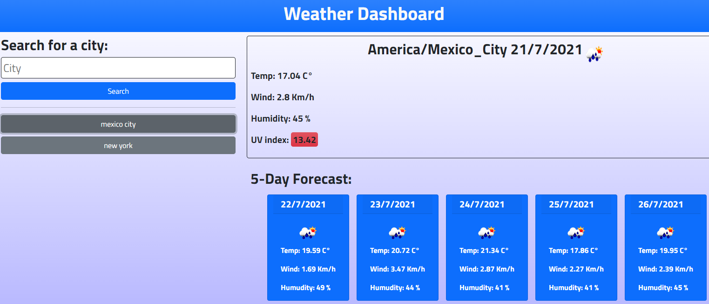

# Weather Dashboard

[](https://opensource.org/licenses/MIT)
## Description
```
AS A traveler
I WANT to see the weather outlook for multiple cities
SO THAT I can plan a trip accordingly
```
## Table of Contents
- [Usage](#usage)
- [Deployed App](#deployed-app)
- [License](#license)
- [Contribute](#contribute)
- [Questions](#questions)

## Usage
```
GIVEN a weather dashboard with form inputs
WHEN I search for a city
THEN I am presented with current and future conditions for that city and that city is added to the search history
WHEN I view current weather conditions for that city
THEN I am presented with the city name, the date, an icon representation of weather conditions, the temperature, the humidity, the wind speed, and the UV index
WHEN I view the UV index
THEN I am presented with a color that indicates whether the conditions are favorable, moderate, or severe
WHEN I view future weather conditions for that city
THEN I am presented with a 5-day forecast that displays the date, an icon representation of weather conditions, the temperature, the wind speed, and the humidity
WHEN I click on a city in the search history
THEN I am again presented with current and future conditions for that city
```

## Deployed App
[https://stamm2911.github.io/Weather-Dashboard/](https://stamm2911.github.io/Weather-Dashboard/)


## License
© Licensed under the MIT License
## Contribute

In general, we follow the "fork-and-pull" Git workflow.

1. Fork the repo on GitHub
2. Clone the project to your own machine
3. Commit changes to your own branch
4. Push your work back up to your fork
5. Submit a Pull request so that we can review your changes
NOTE: Be sure to merge the latest from "upstream" before making a pull request
## Questions
Contact me:

- GitHub: [stamm2911](https://github.com/stamm2911)

- Email: edstamm29@gmail.com